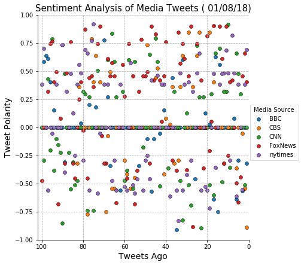
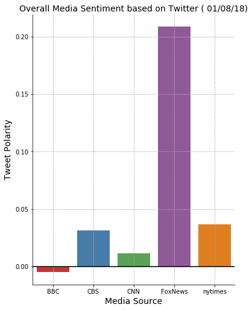

# NEWS MOOD

The assignment consists in perform a sentiment analysis of the Twitter activity of the following news oulets: BBC, CBS, CNN, Fox, and New York Times, and to present the final output a visualized summary of the sentiments expressed in Tweets.


```python
### Needs the following programs and libraries installed:

tweepy==3.5.0
vaderSentiment==2.5
seaborn==0.8
PyYAML==3.12
python-dateutil==2.6.1
pandas==0.20.3
matplotlib==2.1.0
numpy==1.13.3
jupyter==1.0.0
jupyter-client==5.1.0
jupyter-console==5.2.0
jupyter-core==4.3.0
```

### Scatter Plot of Sentiments of the last 100 tweets sent out by each News Outlet


```python

```





### CONCLUSIONS: 

The trends were all over the place. There is not identiable trend. The data are, on average, neutral.
The sentiment was more negative two days ago. 

### Bar Plot visualizing the overall sentiments of the last 100 tweets from each news outlet.


```python

```





### CONCLUSIONS: 

In this graph, FoxNews has more positive tweets on January 8th of 2018 afternoon, maybe because many
people tweet about Golden Globe Awards. 

In addition, it would be better to analyze in a longer period of time because this analysis of only 100 tweets per organization or Media Outlet depends on at what time is done.
